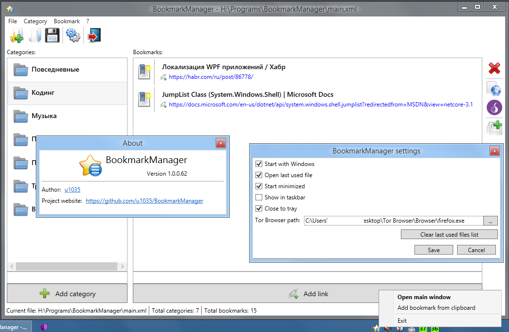

# BookmarkManager
Standalone desktop application to store browser bookmarks

Screenshot of current developing state:

## Application goals
I often making experiments with Windows, sometimes install other OS, change browsers (and use different kind of browsers, like TOR) and I don't like browser extensions and online services for managing bookmarks. So I want to create application for saving my bookmarks in it, and opening links from it. It should have settings and bookmarks database file in application folder and be portable. Maybe it should be able to make backups. Maybe it should (in future) be cross-platform, and work both on Windows and Linux.

## Roadmap

- [x] Icon in system tray
- [x] Nice view for bookmark item (First approach)
- [x] Config page or window
- [x] Help/About window
- [x] Menu bar?
- [x] Status bar with some info - file path, bookmarks/categories count?
- [x] Configurable path to TOR browser
- [x] Open last used database
- [x] List of last used databases in "File" menu
- [x] Open file specified in command line parameters
- [x] Enter in textboxes handling for faster adding
- [x] Button "Open all bookmarks" in category
- [x] Saving window position and size
- [x] "Start with OS", "Start minimized" options
- [x] Current filename in main window title
- [x] Context menus on categories and bookmarks
- [x] Save last selected category
- [x] Editing and deleting categories
- [ ] Editing bookmarks
- [ ] Moving categories and bookmarks Up/Down ?
- [ ] Page preview image or favicon
- [ ] Drag'n'Drop moving bookmarks between categories
- [ ] Asyncronous web page details receiving - not to slow down main app thread
- [ ] Pretty UI, maybe themes, maybe dark theme
- [ ] Localization support
- [ ] Showing main window by hotkey
- [x] Close to tray
- [x] Fix Start Minimized bug
- [x] When category deleted - focus on previous (/next), if exists
- [ ] Categories tree instead of list
- [ ] Backup feature
- [ ] Bookmark search
- [ ] Link testing? (live or broken)
- [ ] Importing from browser?

## Project status

Developing for myself in my free time

## Contributing

Contributions are welcome! Want to join?

* Find bugs and open issues
* Write a code and make pull requests - using tasks from Roadmap or making new incredible features
* Translate program resources to your language
* Fork it and develop it your way

Feel free to contact me here or by [e-mail](mailto:u1035@mail.ru)
